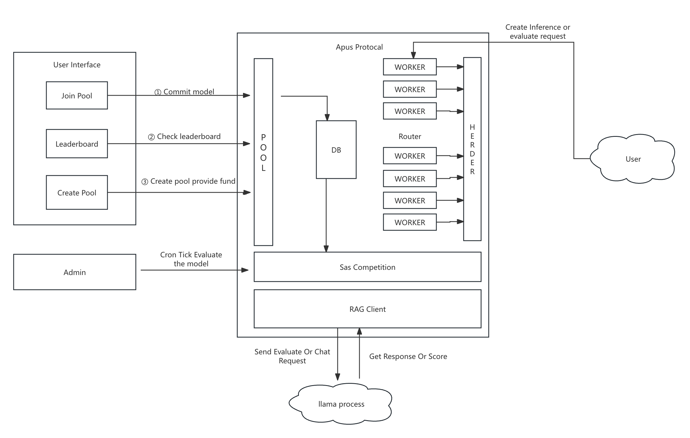

## Tasks on 2024/09/24

- 读项目代码，尝试运行
- 思考相关监控问题

今天首先大概了解了协议中有大概哪些内容。

### Chat Process
- Chat-Question 传入带有dataset_hash以及prompt的消息体，并获得返回值。但RAGClient中调取的SearchPrompt，在embedding中并没有返回值，期待的返回值是context 作为llama层的输入

- Get-Chat-Answer 获取交互的结果

### Herder 

- Worker-Init 供worker注册使用
- Inference 将Chat或者Evaluate的需求加入队列 并触发dispatch
- Worker-Statistics 用于统计忙碌中的worker

### Pool

- CronTick 更新排行
- JoinPool 加入池子参与比赛
- CreatePool 可以创建Pool的时候 指定ProcessId

## Flows

### 池子创建者/竞赛发起者
pool::Create-Pool 接受参数为title，processId, 以及Metadata，透传记录。接受用户的转账

### 竞赛参与者
pool::Join-Pool 检查时间，白名单，重复参与。写入SQL生成一条Participant记录，调用上面那个Process的Join-Pool，也就是sas_competition::Join-Pool, cronTick出发更新评分排名。

### Evaluate/Chat逻辑
先调用RAG的SearchPrompt获取llama层的context，然后获取返回值