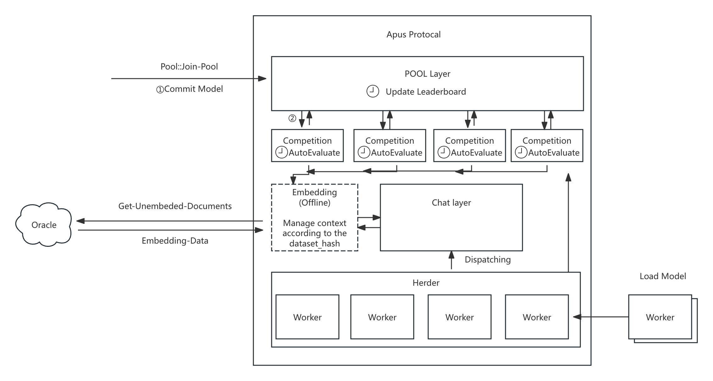
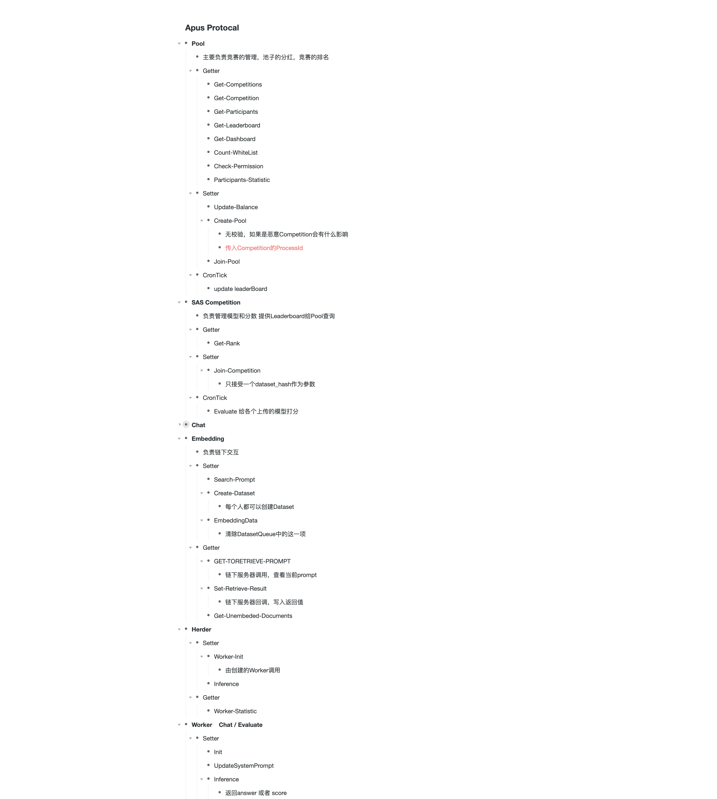

## Tasks on 2024/09/25

- 继续理解项目代码，部署代码
- 构建监控脚本


### Framework



基于目前的理解，池子由我们自行创建，用户负责传输dataset，由embedding层传输给server的haystack做基础的问答以获取更充足的prompt。

embedding server 使用chroma持久化技术，将每一个dataset_hash映射到一个独立的空间，去获得一个完备的prompt。由Oracle服务动态的embedding用户的文档，并且响应链上的获得prompt的请求。

各个调度层面大概如上图所示。Worker的产生尚未得知。

### Details of each layer



### Confusion

目前Herder的dispatch逻辑，似乎是Worker只按照Chat和Evaluate分流，然后每一个请求都随机分配给搭载不同model的Worker。并没有像介绍里面说的一样，由用户提交的训练好的模型来测评。因为发起Chat或者Evaluate的时候，也没有传入model，这边比较弱关联。

或许是还没实现到二期，也可能是还尚未能解决成本问题。就目前来看，似乎只是在评比谁的dataset更能获得一个好的prompt。

Worker的调度逻辑目前还不清楚，不知道是谁在创建这个Worker。从部署脚本来说，还是Worker之间没有什么差别。

### Considerations on Monitor

- [x] 过去一小时参与人数

- [ ] 当前已评估数据集

- [ ] 当前未评估数据集

- [x] 当前运行中Evaluator
  
第一，第四项都在monitor中有体现，关于数据集，应该从Pool中调用Action  Get-Competitions,或者是封装调用getOngoingCompetitions,然后获得其中的Competition的process。

在Competition中添加方法，以获得各种不同的dataset_hash

- TotalEvaluation, count(id)
- Pending, count(reference is NULL)
- InProgress, count(reference is not NULL and responsed_at is NULL)
- Evaluated, count(reference is not NULL or responsed_at is not NULL)

```
  SELECT
      participant_dataset_hash,
      COUNT(id) AS total_evaluations,
      SUM(CASE WHEN e.reference IS NOT NULL AND e.response_at IS NOT NULL THEN 1 ELSE 0 END) AS finished_evaluations,
      SUM(CASE WHEN e.reference IS NOT NULL AND e.response_at IS NULL THEN 1 ELSE 0 END) AS processing_evaluations,
      SUM(CASE WHEN e.reference IS NULL THEN 1 ELSE 0 END) AS pending_evaluations
  FROM
      evaluations
  GROUP BY
      participant_dataset_hash
```

